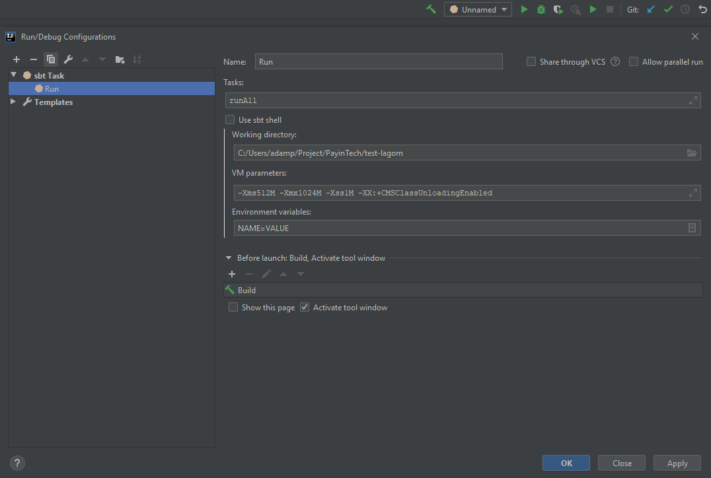

## IntelliJ QuickStart !

There are two main way to start the project.
One is by using the shell SBT, the other is by using an IntelliJ SBT Task.

### Using sbt shell (not recommended way)
Using the sbt shell can be interesting for several reasons.
Theses include a direct access to all SBT commands (reload, stage, etc) and the possibility to have the SBT shell running outside of IntelliJ.

But ... This configuration is sadly not optimal for development. One problem that you will encounter very soon is debugging.
If you're using the IntelliJ SBT shell, you will be a bit more comfortable as IntelliJ set a random port for the debugger.
But attaching the debugger is a pain never the less. And if you restart your server for any reasons, you will need to restart your debugger as well...
And other problem will be the un-ability to change in an easy way your environment variables.

### Using an SBT Task (recommend way)
This is not only the simplest way to setup and run the project but also the simplest way to debug the project by utilizing the IntelliJ configuration system.

Here is how to configure it :


Then you will be able to start or debug all the micro-services as if it was a standard project.
The environment variables are easily accessible if you disable the option "Use sbt shell". 
Plus by using the "before launch" options, the section "[Delete lock file of Kafka](#delete-lock-file-of-kafka-server-during-development)"
will tell you how to solve a small problem that you can encounter with the embedded kafka server.


### Delete lock file of Kafka server during development
The embedded kafka server is sometimes unable to restart after a stop.
This is due to a lock file that is not removed at shutdown.

A script to delete lock file is available in the repository and does the following.

```
#!/bin/bash
rm -rf ./target/lagom-dynamic-projects/lagom-internal-meta-project-kafka/target/kafka_data
```

Add to your run/debug configuration (sbt Task) an external tool before launch.
For example, one can have the following parameters: Program to run `C:\Program Files\Git\bin\sh.exe`,
as arguments `-l "cleanKafka.sh"` and for the working directory, your `test-lagom` git folder.


## How to use an external Kafka for development
In order to use an external Kafka server, you will need to disable the embedded Kafka server that comes with Lagom.

The environment variable `DISABLE_EMBEDDED_KAFKA` allows you to do so.
No specific value need to be set but you can do `DISABLE_EMBEDDED_KAFKA=TRUE`.

Then you must specify an endpoint for the broker. You may also do so by using an environment variable.
Here is an example `LAGOM_BROKER_KAFKA_BROKERS=192.168.1.5:9092`.

